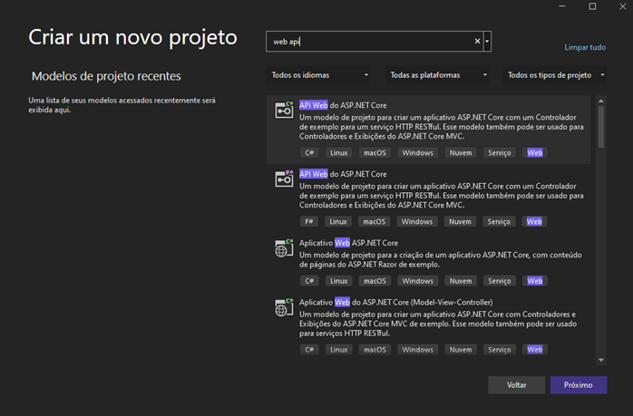

# Serilog : Criando logs para console, arquivo e banco de dados

Neste artigo voltamos a tratar com o **Serilog** uma biblioteca para registro de diagnósticos, e log para arquivos, e veremos como criar registro de eventos via console, em arquivos texto e json e em um banco de dados SQL Server.

O **Serilog** é uma biblioteca que você pode usar em aplicações .NET para realizar o logging. Ela é simples, fácil de configurar, tem uma API limpa e é portátil entre plataformas .NET recentes.

Eu já apresentei o **Serilog** e mostrei como usar alguns dos seus recursos neste artigo: [C# - Usando o Serilog](http://www.macoratti.net/18/05/c_serilog1.htm)

Neste artigo veremos como criar logs para console, arquivos e para um banco de dados SQL Server de forma bem simples usando o **Serilog**.

Vamos criar um projeto ASP .NET Core Web API usando o template padrão e neste projeto vamos mostrar como criar os logs definindo as configurações no arquivo appsettings.json.

Recursos usados:

- .NET Core SDK 5.0
- Visual Studio 2019 16.9.3
- Bibliotecas Serilog

## Criando a Web API ASP .NET Core





A seguir vamos incluir os seguintes pacotes do Serilog em nosso projeto:

```ps
Install-Package Serilog.AspNetCore
Install-Package Serilog.Sinks.MSSqlServer
Install-Package Serilog.Enrichers.Environment
Install-Package Serilog.Enrichers.Thread
Install-Package Serilog.Enrichers.Process
```

## Configurando o Serilog no arquivo Program

Agora vamos definir o código para configurar o Serilog no arquivo Program.cs do projeto usando o código a seguir:

<details>
<summary>Program.cs</summary>

```c#
// >>> Serilog ------------------------------------------------------------------------------------------

using Serilog;

var config = new ConfigurationBuilder()
    .AddJsonFile("appsettings.json").Build();

Log.Logger = new LoggerConfiguration()
    .ReadFrom.Configuration(config).CreateLogger();

// ------------------------------------------------------------------------------------------ Serilog <<<

var builder = WebApplication.CreateBuilder(args);

// Add services to the container.

builder.Services.AddControllers();
// Learn more about configuring Swagger/OpenAPI at https://aka.ms/aspnetcore/swashbuckle
builder.Services.AddEndpointsApiExplorer();
builder.Services.AddSwaggerGen();

// >>> Serilog ------------------------------------------------------------------------------------------

builder.Host.UseSerilog();

// ------------------------------------------------------------------------------------------ Serilog <<<

var app = builder.Build();

// Configure the HTTP request pipeline.
if (app.Environment.IsDevelopment())
{
    app.UseSwagger();
    app.UseSwaggerUI();
}

app.UseAuthorization();

app.MapControllers();

// >>> Serilog ------------------------------------------------------------------------------------------

try
{
    Log.Information("API inicializando");
    app.Run();
}
catch (Exception ex)
{
    Log.Fatal(ex, "A aplicação falhou ao iniciar");
}
finally
{
    Log.CloseAndFlush();
}

// ------------------------------------------------------------------------------------------ Serilog <<<
```

</details>

# Referências

> [Macoratti](http://www.macoratti.net/21/04/c_serilog1.htm)
