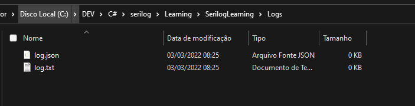

# Serilog : Criando logs para console, arquivo e banco de dados

O **Serilog** é uma biblioteca para log de informações de qualquer aplicação .NET que trabalha com **Sinks** como base. Uma estrutura que permite salvar quaisquer tipos de informação, de forma organizada, durante a execução da aplicação.

## Sinks

O **Serilog** possui apenas a implementação básica dos logs.
Os **Sinks** permitem escrever logs em arquivo, e-mails, Discord etc.

**Sink.File**
**Sink.Email**
**Sink.Discord**

Também é possível criar **Sink** customizado.

## Exemplos:

<details><summary>Startup</summary>

</details>

<details><summary>AppSettings</summary>

## Criando a Web API ASP .NET Core

Neste artigo veremos como criar logs para console, arquivos e para um banco de dados SQL Server de forma bem simples usando o **Serilog**.

Vamos criar um projeto ASP .NET Core Web API usando o template padrão e neste projeto vamos mostrar como criar os logs definindo as configurações no arquivo appsettings.json.

Recursos usados:

- .NET Core SDK 5.0
- Visual Studio 2019 16.9.3
- Bibliotecas Serilog

<details><summary>Criação do Projeto</summary>


</details>

A seguir vamos incluir os seguintes pacotes do Serilog em nosso projeto:

```ps
Install-Package Serilog.AspNetCore
Install-Package Serilog.Sinks.MSSqlServer
Install-Package Serilog.Enrichers.Environment
Install-Package Serilog.Enrichers.Thread
Install-Package Serilog.Enrichers.Process
```

## Configurando o Serilog no arquivo Program

Agora vamos definir o código para configurar o Serilog no arquivo Program.cs do projeto usando o código a seguir:

<details>
<summary>Program.cs</summary>

```c#
// >>> Serilog ------------------------------------------------------------------------------------------

using Serilog;

var config = new ConfigurationBuilder()
    .AddJsonFile("appsettings.json").Build();

Log.Logger = new LoggerConfiguration()
    .ReadFrom.Configuration(config).CreateLogger();

// ------------------------------------------------------------------------------------------ Serilog <<<

var builder = WebApplication.CreateBuilder(args);

// Add services to the container.

builder.Services.AddControllers();
// Learn more about configuring Swagger/OpenAPI at https://aka.ms/aspnetcore/swashbuckle
builder.Services.AddEndpointsApiExplorer();
builder.Services.AddSwaggerGen();

// >>> Serilog ------------------------------------------------------------------------------------------

builder.Host.UseSerilog();

// ------------------------------------------------------------------------------------------ Serilog <<<

var app = builder.Build();

// Configure the HTTP request pipeline.
if (app.Environment.IsDevelopment())
{
    app.UseSwagger();
    app.UseSwaggerUI();
}

app.UseAuthorization();

app.MapControllers();

// >>> Serilog ------------------------------------------------------------------------------------------

try
{
    Log.Information("API inicializando");
    app.Run();
}
catch (Exception ex)
{
    Log.Fatal(ex, "A aplicação falhou ao iniciar");
}
finally
{
    Log.CloseAndFlush();
}

// ------------------------------------------------------------------------------------------ Serilog <<<
```

Neste código estamos habilitando a leitura do arquivo **appsettings.json** pois nele vamos criar as definições dos logs que desejamos criar. Para isso o **Serilog** vai ter que ler o arquivo **appsettings.json** para obter as definições e criar os respectivos logs.

A seguir vamos criar o **logger raiz** usando o **LoggerConfiguration** e para isso usamos uma instancia de **LoggerConfiguration** e a partir das informações obtidas no arquivo **appsettings.json** criamos um **logger** usando as **sinks**, os **enrichers** e as demais definições do arquivo **appsettings.json**.

A seguir definimos o **Serilog** como provedor de log ao invés de usar o recurso padrão da plataforma .NET.

</details>

## Definindo as configurações dos logs no arquivo appsettins.json

Agora precisamos definir as configurações dos logs no arquivo **appsettings.json**. Vamos criar logs no console, em arquivos e em um banco de dados e para isso vamos usar o código a seguir:

<details><summary>AppSettings.json</summary>

```json
{
  "Logging": {
    "LogLevel": {
      "Default": "Information",
      "Microsoft.AspNetCore": "Warning"
    }
  },
  "AllowedHosts": "*",

  // >>> Serilog ------------------------------------------------------------------------------------------

  "Serilog": {
    "Using": [],
    "MinimumLevel": {
      "Default": "Information",
      "Override": {
        "Microsoft": "Warning",
        "System": "Warning"
      }
    },
    "WriteTo": [
      {
        "Name": "Console"
      },
      {
        "Name": "File",
        "Args": {
          "path": "C:\\DEV\\C#\\serilog\\Learning\\SerilogLearning\\Logs\\log.txt",
          "outputTemplate": "{Timestamp} {Message}{NewLine:1}{Exception:1}"
        }
      },
      {
        "Name": "File",
        "Args": {
          "path": "C:\\DEV\\C#\\serilog\\Learning\\SerilogLearning\\Logs\\log.json",
          "formatter": "Serilog.Formatting.Json.JsonFormatter, Serilog"
        }
      },
      {
        "Name": "MSSqlServer",
        "Args": {
          "connectionString": "Data Source=BARBIERI\\SQLEXPRESS;Initial Catalog=Serilog;Integrated Security=True",
          "sinkOptionsSection": {
            "tableName": "Logs",
            "autoCreateSqlTable": true
          },
          "restrictedToMinimumLevel": "Warning"
        }
      }
    ],
    "Enrich": [
      "FromLogContext",
      "WithMachineName",
      "WithProcessId",
      "WithThreadId"
    ],
    "Properties": {
      "ApplicationName": "Serilog.WebAPI"
    }

    // ------------------------------------------------------------------------------------------ Serilog <<<
  }
}
```

</details>

Criamos a seção **Serilog** no arquivo e a seguir usando o método **WriteTo** definimos 3 tipos de log:

1. Console
2. File
3. MSSqlServer

Em cada definição precisamos informar as definições pertinentes.

Estamos gerando logs para arquivos em dois formatos: texto e JSON.

Para criar o log para o banco de dados SQL Server informamos a string de conexão contendo o nome do banco de dados, o nome da tabela a ser criada e aplicamos o atributo **autoCreateSqlTable**. Com isso será criada a tabela Logs no banco de dados **DemoSerilogDB** com a seguinte estrutura padrão:

| Nome da Coluna  | Tipo de Dados | Permitir Nulo |
| :-------------- | :------------ | :-----------: |
| Id              | int           |      Não      |
| Message         | nvarchar(max) |      Sim      |
| MessageTemplate | nvarchar(max) |      Sim      |
| [Level]         | nvarchar(max) |      Sim      |
| TimeStamp       | datetime      |      Sim      |
| Exception       | nvarchar(max) |      Sim      |
| Properties      | nvarchar(max) |      Sim      |

Assim, agora podemos definir o registro dos logs no controlador WeatherForecast criado por padrão.

<details><summary>Controllers/WeatherForecastController.cs</summary>

```c#
using Microsoft.AspNetCore.Mvc;

namespace SerilogLearning.Controllers
{
    [ApiController]
    [Route("[controller]")]
    public class WeatherForecastController : ControllerBase
    {
        private static readonly string[] Summaries = new[]
        {
        "Freezing", "Bracing", "Chilly", "Cool", "Mild", "Warm", "Balmy", "Hot", "Sweltering", "Scorching"
    };

        private readonly ILogger<WeatherForecastController> _logger;

        public WeatherForecastController(ILogger<WeatherForecastController> logger)
        {
            _logger = logger;
            _logger.LogInformation("WeatherForecast instanciando ILogger");
        }

        [HttpGet(Name = "GetWeatherForecast")]
        public IEnumerable<WeatherForecast> Get()
        {
            //return Enumerable.Range(1, 5).Select(index => new WeatherForecast
            //{
            //    Date = DateTime.Now.AddDays(index),
            //    TemperatureC = Random.Shared.Next(-20, 55),
            //    Summary = Summaries[Random.Shared.Next(Summaries.Length)]
            //})
            //.ToArray();

            _logger.LogInformation("endpoint GET -> WeatherForecast.Get()");
            int count;
            try
            {
                for (count = 0; count <= 5; count++)
                {
                    if (count == 3)
                        throw new Exception("Ocorreu uma Exception Aleatória... ");
                    else
                        _logger.LogInformation($"Número de iterações {count}");
                }
                var rng = new Random();
                return Enumerable.Range(1, 5).Select(index => new WeatherForecast
                {
                    Date = DateTime.Now.AddDays(index),
                    TemperatureC = rng.Next(-20, 55),
                    Summary = Summaries[rng.Next(Summaries.Length)]
                })
                .ToArray();
            }
            catch (Exception ex)
            {
                _logger.LogError(ex, $"endpoint GET -> WeatherForecast.Get() - Exception ");
                throw;
            }
        }
    }
}
```

</details>

No método **Get** do **controller WeatherForecast** incluímos alguns registros de eventos para o nível **information** e **error**.

Para executar o projeto selecione o projeto **Serilog_Demo** e execute. Veremos a interface do **swagger** exibir o **endpoint GET** que quando acionado irá executar o método GET do controller.

Teremos o resultado abaixo:

<details><summary>Resultado</summary>


</details>

Agora vamos verificar os logs gerados:

<details><summary>1. Console</summary>


</details>

<details><summary>2. Arquivos</summary>

Os arquivos **log.txt** e **log.json** na pasta **C:\DEV\C#\serilog\Learning\SerilogLearning\Logs**




<details>
<summary>log.txt</summary>

```txt
03/03/2022 08:26:13 -03:00 API inicializando
03/03/2022 08:26:30 -03:00 WeatherForecast instanciando ILogger
03/03/2022 08:26:30 -03:00 endpoint GET -> WeatherForecast.Get()
03/03/2022 08:26:30 -03:00 Número de iterações 0
03/03/2022 08:26:30 -03:00 Número de iterações 1
03/03/2022 08:26:30 -03:00 Número de iterações 2
03/03/2022 08:26:30 -03:00 endpoint GET -> WeatherForecast.Get() - Exception
System.Exception: Ocorreu uma Exception Aleatória...
   at SerilogLearning.Controllers.WeatherForecastController.Get() in C:\DEV\C#\serilog\Learning\SerilogLearning\Controllers\WeatherForecastController.cs:line 40
03/03/2022 08:27:57 -03:00 An unhandled exception has occurred while executing the request.
System.Exception: Ocorreu uma Exception Aleatória...
   at SerilogLearning.Controllers.WeatherForecastController.Get() in C:\DEV\C#\serilog\Learning\SerilogLearning\Controllers\WeatherForecastController.cs:line 40
   at lambda_method2(Closure , Object , Object[] )
   at Microsoft.AspNetCore.Mvc.Infrastructure.ActionMethodExecutor.SyncObjectResultExecutor.Execute(IActionResultTypeMapper mapper, ObjectMethodExecutor executor, Object controller, Object[] arguments)
   at Microsoft.AspNetCore.Mvc.Infrastructure.ControllerActionInvoker.InvokeActionMethodAsync()
   at Microsoft.AspNetCore.Mvc.Infrastructure.ControllerActionInvoker.Next(State& next, Scope& scope, Object& state, Boolean& isCompleted)
   at Microsoft.AspNetCore.Mvc.Infrastructure.ControllerActionInvoker.InvokeNextActionFilterAsync()
--- End of stack trace from previous location ---
   at Microsoft.AspNetCore.Mvc.Infrastructure.ControllerActionInvoker.Rethrow(ActionExecutedContextSealed context)
   at Microsoft.AspNetCore.Mvc.Infrastructure.ControllerActionInvoker.Next(State& next, Scope& scope, Object& state, Boolean& isCompleted)
   at Microsoft.AspNetCore.Mvc.Infrastructure.ControllerActionInvoker.InvokeInnerFilterAsync()
--- End of stack trace from previous location ---
   at Microsoft.AspNetCore.Mvc.Infrastructure.ResourceInvoker.<InvokeFilterPipelineAsync>g__Awaited|20_0(ResourceInvoker invoker, Task lastTask, State next, Scope scope, Object state, Boolean isCompleted)
   at Microsoft.AspNetCore.Mvc.Infrastructure.ResourceInvoker.<InvokeAsync>g__Awaited|17_0(ResourceInvoker invoker, Task task, IDisposable scope)
   at Microsoft.AspNetCore.Mvc.Infrastructure.ResourceInvoker.<InvokeAsync>g__Awaited|17_0(ResourceInvoker invoker, Task task, IDisposable scope)
   at Microsoft.AspNetCore.Routing.EndpointMiddleware.<Invoke>g__AwaitRequestTask|6_0(Endpoint endpoint, Task requestTask, ILogger logger)
   at Microsoft.AspNetCore.Authorization.AuthorizationMiddleware.Invoke(HttpContext context)
   at Swashbuckle.AspNetCore.SwaggerUI.SwaggerUIMiddleware.Invoke(HttpContext httpContext)
   at Swashbuckle.AspNetCore.Swagger.SwaggerMiddleware.Invoke(HttpContext httpContext, ISwaggerProvider swaggerProvider)
   at Microsoft.AspNetCore.Diagnostics.DeveloperExceptionPageMiddleware.Invoke(HttpContext context)

```

</details>

<details>
<summary>log.json</summary>

```json
{
	"Timestamp": "2022-03-03T08:26:13.3543120-03:00",
	"Level": "Information",
	"MessageTemplate": "API inicializando",
	"Properties": {
		"MachineName": "BARBIERI",
		"ProcessId": 4332,
		"ThreadId": 1,
		"ApplicationName": "Serilog.WebAPI"
	}
}
{
	"Timestamp": "2022-03-03T08:26:30.5004378-03:00",
	"Level": "Information",
	"MessageTemplate": "WeatherForecast instanciando ILogger",
	"Properties": {
		"SourceContext": "SerilogLearning.Controllers.WeatherForecastController",
		"ActionId": "8e66dc87-e74f-4451-978f-3489f6ab7716",
		"ActionName": "SerilogLearning.Controllers.WeatherForecastController.Get (SerilogLearning)",
		"RequestId": "0HMFT12G34BMO:00000002",
		"RequestPath": "/WeatherForecast",
		"ConnectionId": "0HMFT12G34BMO",
		"MachineName": "BARBIERI",
		"ProcessId": 4332,
		"ThreadId": 4,
		"ApplicationName": "Serilog.WebAPI"
	}
}
{
	"Timestamp": "2022-03-03T08:26:30.5245035-03:00",
	"Level": "Information",
	"MessageTemplate": "endpoint GET -> WeatherForecast.Get()",
	"Properties": {
		"SourceContext": "SerilogLearning.Controllers.WeatherForecastController",
		"ActionId": "8e66dc87-e74f-4451-978f-3489f6ab7716",
		"ActionName": "SerilogLearning.Controllers.WeatherForecastController.Get (SerilogLearning)",
		"RequestId": "0HMFT12G34BMO:00000002",
		"RequestPath": "/WeatherForecast",
		"ConnectionId": "0HMFT12G34BMO",
		"MachineName": "BARBIERI",
		"ProcessId": 4332,
		"ThreadId": 4,
		"ApplicationName": "Serilog.WebAPI"
	}
}
{
	"Timestamp": "2022-03-03T08:26:30.5265116-03:00",
	"Level": "Information",
	"MessageTemplate": "Número de iterações 0",
	"Properties": {
		"SourceContext": "SerilogLearning.Controllers.WeatherForecastController",
		"ActionId": "8e66dc87-e74f-4451-978f-3489f6ab7716",
		"ActionName": "SerilogLearning.Controllers.WeatherForecastController.Get (SerilogLearning)",
		"RequestId": "0HMFT12G34BMO:00000002",
		"RequestPath": "/WeatherForecast",
		"ConnectionId": "0HMFT12G34BMO",
		"MachineName": "BARBIERI",
		"ProcessId": 4332,
		"ThreadId": 4,
		"ApplicationName": "Serilog.WebAPI"
	}
}
{
	"Timestamp": "2022-03-03T08:26:30.5284627-03:00",
	"Level": "Information",
	"MessageTemplate": "Número de iterações 1",
	"Properties": {
		"SourceContext": "SerilogLearning.Controllers.WeatherForecastController",
		"ActionId": "8e66dc87-e74f-4451-978f-3489f6ab7716",
		"ActionName": "SerilogLearning.Controllers.WeatherForecastController.Get (SerilogLearning)",
		"RequestId": "0HMFT12G34BMO:00000002",
		"RequestPath": "/WeatherForecast",
		"ConnectionId": "0HMFT12G34BMO",
		"MachineName": "BARBIERI",
		"ProcessId": 4332,
		"ThreadId": 4,
		"ApplicationName": "Serilog.WebAPI"
	}
}
{
	"Timestamp": "2022-03-03T08:26:30.5302296-03:00",
	"Level": "Information",
	"MessageTemplate": "Número de iterações 2",
	"Properties": {
		"SourceContext": "SerilogLearning.Controllers.WeatherForecastController",
		"ActionId": "8e66dc87-e74f-4451-978f-3489f6ab7716",
		"ActionName": "SerilogLearning.Controllers.WeatherForecastController.Get (SerilogLearning)",
		"RequestId": "0HMFT12G34BMO:00000002",
		"RequestPath": "/WeatherForecast",
		"ConnectionId": "0HMFT12G34BMO",
		"MachineName": "BARBIERI",
		"ProcessId": 4332,
		"ThreadId": 4,
		"ApplicationName": "Serilog.WebAPI"
	}
}
{
	"Timestamp": "2022-03-03T08:26:30.6398230-03:00",
	"Level": "Error",
	"MessageTemplate": "endpoint GET -> WeatherForecast.Get() - Exception ",
	"Exception": "System.Exception: Ocorreu uma Exception Aleatória... \r\n   at SerilogLearning.Controllers.WeatherForecastController.Get() in C:\\DEV\\C#\\serilog\\Learning\\SerilogLearning\\Controllers\\WeatherForecastController.cs:line 40",
	"Properties": {
		"SourceContext": "SerilogLearning.Controllers.WeatherForecastController",
		"ActionId": "8e66dc87-e74f-4451-978f-3489f6ab7716",
		"ActionName": "SerilogLearning.Controllers.WeatherForecastController.Get (SerilogLearning)",
		"RequestId": "0HMFT12G34BMO:00000002",
		"RequestPath": "/WeatherForecast",
		"ConnectionId": "0HMFT12G34BMO",
		"MachineName": "BARBIERI",
		"ProcessId": 4332,
		"ThreadId": 4,
		"ApplicationName": "Serilog.WebAPI"
	}
}
{
	"Timestamp": "2022-03-03T08:27:57.7895882-03:00",
	"Level": "Error",
	"MessageTemplate": "An unhandled exception has occurred while executing the request.",
	"Exception": "System.Exception: Ocorreu uma Exception Aleatória... \r\n   at SerilogLearning.Controllers.WeatherForecastController.Get() in C:\\DEV\\C#\\serilog\\Learning\\SerilogLearning\\Controllers\\WeatherForecastController.cs:line 40\r\n   at lambda_method2(Closure , Object , Object[] )\r\n   at Microsoft.AspNetCore.Mvc.Infrastructure.ActionMethodExecutor.SyncObjectResultExecutor.Execute(IActionResultTypeMapper mapper, ObjectMethodExecutor executor, Object controller, Object[] arguments)\r\n   at Microsoft.AspNetCore.Mvc.Infrastructure.ControllerActionInvoker.InvokeActionMethodAsync()\r\n   at Microsoft.AspNetCore.Mvc.Infrastructure.ControllerActionInvoker.Next(State& next, Scope& scope, Object& state, Boolean& isCompleted)\r\n   at Microsoft.AspNetCore.Mvc.Infrastructure.ControllerActionInvoker.InvokeNextActionFilterAsync()\r\n--- End of stack trace from previous location ---\r\n   at Microsoft.AspNetCore.Mvc.Infrastructure.ControllerActionInvoker.Rethrow(ActionExecutedContextSealed context)\r\n   at Microsoft.AspNetCore.Mvc.Infrastructure.ControllerActionInvoker.Next(State& next, Scope& scope, Object& state, Boolean& isCompleted)\r\n   at Microsoft.AspNetCore.Mvc.Infrastructure.ControllerActionInvoker.InvokeInnerFilterAsync()\r\n--- End of stack trace from previous location ---\r\n   at Microsoft.AspNetCore.Mvc.Infrastructure.ResourceInvoker.<InvokeFilterPipelineAsync>g__Awaited|20_0(ResourceInvoker invoker, Task lastTask, State next, Scope scope, Object state, Boolean isCompleted)\r\n   at Microsoft.AspNetCore.Mvc.Infrastructure.ResourceInvoker.<InvokeAsync>g__Awaited|17_0(ResourceInvoker invoker, Task task, IDisposable scope)\r\n   at Microsoft.AspNetCore.Mvc.Infrastructure.ResourceInvoker.<InvokeAsync>g__Awaited|17_0(ResourceInvoker invoker, Task task, IDisposable scope)\r\n   at Microsoft.AspNetCore.Routing.EndpointMiddleware.<Invoke>g__AwaitRequestTask|6_0(Endpoint endpoint, Task requestTask, ILogger logger)\r\n   at Microsoft.AspNetCore.Authorization.AuthorizationMiddleware.Invoke(HttpContext context)\r\n   at Swashbuckle.AspNetCore.SwaggerUI.SwaggerUIMiddleware.Invoke(HttpContext httpContext)\r\n   at Swashbuckle.AspNetCore.Swagger.SwaggerMiddleware.Invoke(HttpContext httpContext, ISwaggerProvider swaggerProvider)\r\n   at Microsoft.AspNetCore.Diagnostics.DeveloperExceptionPageMiddleware.Invoke(HttpContext context)",
	"Properties": {
		"EventId": {
			"Id": 1,
			"Name": "UnhandledException"
		},
		"SourceContext": "Microsoft.AspNetCore.Diagnostics.DeveloperExceptionPageMiddleware",
		"RequestId": "0HMFT12G34BMO:00000002",
		"RequestPath": "/WeatherForecast",
		"ConnectionId": "0HMFT12G34BMO",
		"MachineName": "BARBIERI",
		"ProcessId": 4332,
		"ThreadId": 4,
		"ApplicationName": "Serilog.WebAPI"
	}
}
```

</details>

</details>

<details><summary>3. Banco de Dados</summary>

O log no banco de dados DemoSerilogDB onde foi criada a tabela Logs com o conteúdo abaixo:


</details>

Vimos assim como foi fácil criar logs definindo as configurações no arquivo **appsettings.json** usando o **Serilog**.

</details>

# Referências

> [Balta.io](https://balta.io/blog/aspnet-serilog)

> [Macoratti](http://www.macoratti.net/21/04/c_serilog1.htm)
